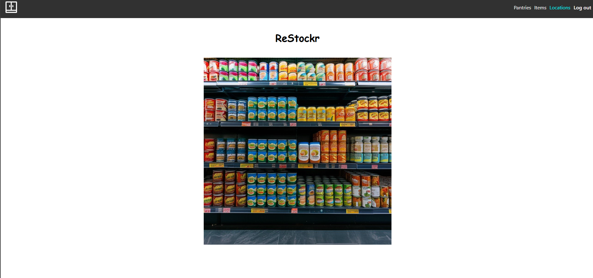

# ReStockr

## Screenshot/Logo

## What is ReStockr?
ReStockr is an easy-to-use pantry tracker. It can not only be used to track the inventory of your pantry, but also track where you purchased your items from. As an added bonus, any items that you mark as "out-of-stock" will be automatically added to your shopping list!

## Links
- Site: https://restockr-1a3bf4105f6c.herokuapp.com/
- Planning: https://trello.com/b/FFgPScmc/project-4-planning-shared-pantry-lists

## Attributions
- https://stockcake.com
- https://www.svgrepo.com

## Technologies Used
- Python
- Django
- CSS

## Next Steps
- Convert project to utilize React, Javascript, and MongoDB
  - This will allow for the creation of single-page applications
- Connect Walmart API
- Connect Target API
- Connect Costco API
- Create table view for item display
- Allow incrementing and decrementing quantities on a single page
- Create "shopping list" for items that are at 0 quantity within a pantry